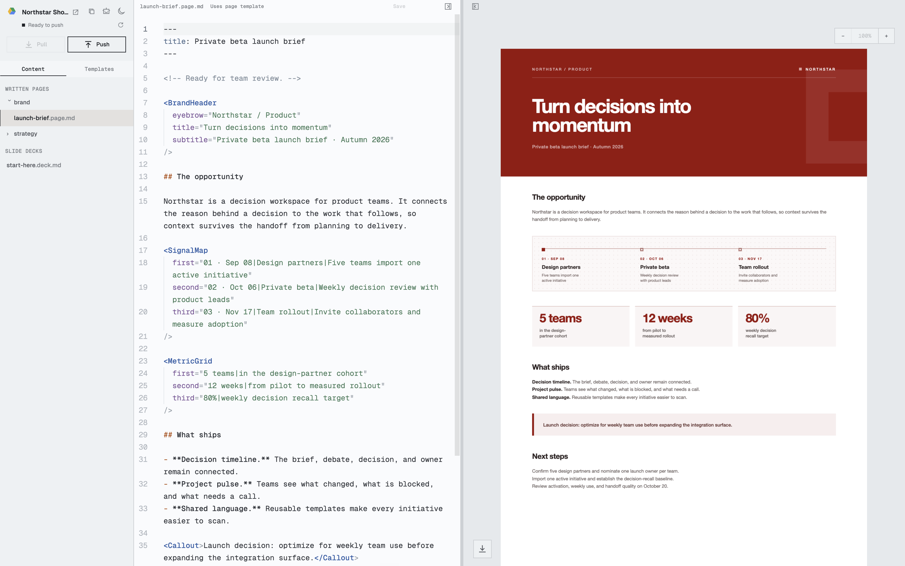

<p align="center"></p>

# Stamp

Stamp turns Markdown, TSX components, and Tailwind themes into visually in-brand documents.
Projects are ordinary folders; Google Drive or Notion stores shared revisions; Studio
is a focused local editor.

<p align="center"></p>

## Quick start

```sh
brew install jhleao/tap/stamp
stamp setup
stamp new quarterly --name "Quarterly update"
cd quarterly
stamp studio
```

In Studio, click **Copy Agent Instructions** in the top-left. Paste the prompt
into your agent of choice, then work away.

## Work with your team in Notion

Install Stamp, then run the guided setup once:

```sh
brew install jhleao/tap/stamp
stamp setup notion
```

Setup checks and offers to install rendering tools, connects Notion, asks whether
to create or clone a project, and offers to open Studio. To join a project,
paste the **root Stamp project page URL** shared by your teammate.

When prompted, create your own [Notion personal access token](https://www.notion.so/developers/tokens)
with **Notion API** enabled in the project's workspace. Paste it into Stamp's
hidden terminal prompt. Stamp validates it and saves it in **macOS Keychain**;
future terminals and Studio sessions use it automatically. Nothing goes in your
shell profile or project files. Each collaborator needs edit access to the root
project and its subpages, and permission to create personal tokens. Guests and
restricted members cannot create them; workspace policy may require an admin's
help. See [Notion permissions and setup](docs/notion.md).

For a direct setup, or to replace an expired token:

```sh
stamp login notion
stamp clone my-project --backend notion --notion-page '<root project URL>'
cd my-project
stamp studio
```

Then use the usual workflow (or Studio's pull and push controls):

```sh
stamp pull
# Edit and preview your work.
stamp push --message "Update the quarterly summary"
```

`stamp logout notion` removes the saved credential from Keychain. It does not
revoke the token in Notion. `STAMP_NOTION_TOKEN` remains an optional override for
automation; unset it to use the saved credential. One Notion token is saved per
macOS user; run `stamp login notion` again to switch accounts or workspaces.

## Update

Release builds used from an interactive terminal check GitHub for a newer
version at most once per day. The check has a short timeout, never blocks a
command after its cached result is fresh, and can be disabled with
`STAMP_NO_UPDATE_CHECK=1`.

```sh
stamp update --check       # check without changing anything
stamp update               # review and install the latest release
stamp update --yes         # install without the confirmation prompt
```

Homebrew installations stay owned by Homebrew; Stamp reports available updates
and directs those installations to `brew upgrade stamp`.

Stamp downloads the archive for the current operating system and architecture,
verifies it against the release's SHA-256 manifest, validates the embedded
version, and atomically replaces the current binary. Self-update is intended
for release binaries installed directly in a user-writable location such as
`$HOME/.local/bin`; source builds should be rebuilt with `make install`.

## Commands

```text
stamp login [drive|notion] | logout [drive|notion]
stamp setup [drive|notion]
stamp new <dir> [--name <name>] [--choose-drive-folder]
stamp clone [dir]
stamp remote [set [--dir <dir>] [--yes]]
stamp pull [--incoming|--replace]
stamp push [--message <text>] [--force-with-lease <version>]
stamp studio [--dir <dir>] [--no-open]
stamp skill
stamp tutorial
stamp doctor
stamp update [--check|--yes]
stamp version
```

## Diagnostics

Add `--verbose` before any command to print sanitized production diagnostics
to stderr. The log covers CLI lifecycle, Google OAuth and Picker, every Google
Drive and Notion HTTP requests and responses, collaboration decisions, rendering, output
mirroring, Studio startup, and updater traffic.

```sh
stamp --verbose clone 2>&1 | tee stamp-debug.log
stamp --verbose pull 2>&1 | tee stamp-debug.log
stamp --verbose push --message "Ready for review" 2>&1 | tee stamp-debug.log
```

`STAMP_VERBOSE=1` enables the same diagnostics. Authorization headers, OAuth
codes and tokens, API keys, URL query strings, and file contents are omitted or
redacted. Review filenames and Drive IDs before sharing a log outside your
team.

## Uninstall

```sh
stamp logout
brew uninstall stamp
rm -rf "$HOME/Library/Application Support/Stamp"
```

For fallback or source installations, remove `$HOME/.local/bin/stamp` instead.
Project folders and remote data are never removed automatically.

## Reference

- [Getting started](docs/getting-started.md)
- [Google Drive](docs/drive.md)
- [Notion](docs/notion.md)
- [Themes](docs/templates.md)
- [Studio](docs/studio.md)
- [Agents](docs/agents.md)
- [Uninstall](docs/uninstall.md)

## Notion backend

Notion is an optional remote for project archives and rendered pages. Use
`stamp new <directory> --backend notion` with `STAMP_NOTION_TOKEN` set to your
personal access token, or authenticate once with `stamp login notion`. See [Notion setup, permissions, and collaboration](docs/notion.md).
